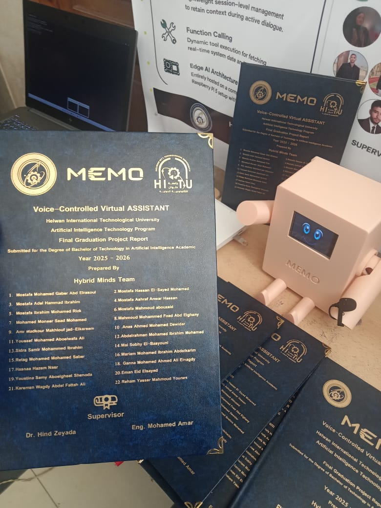
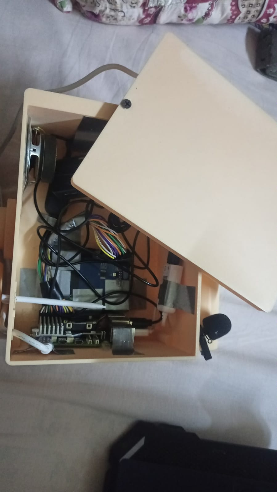

# Memo
An AI-powered voice assistant built with Speech-to-Text, Large Language Models, and Text-to-Speech for natural, real-time voice conversations.

## hardware components:
-raspberry pi 5 (8 GB RAM)
-LCD display 3.2 inch
-microphone (the input)
-speakers (the output)
-active fan/heatsink for raspberry pi
-MicroSD 64GB

## Software Details

### Tech Stack & Core Libraries
* **Local Large Language Model (LLM):** `qwen3:1.7b` running locally via **Ollama** to ensure 100% data privacy, zero API costs, and ultra-low latency response times.
* **Speech-to-Text (STT):** Powered by the `SpeechRecognition` library (utilizing Google Speech API) for highly accurate, real-time voice-to-text conversion.
* **Text-to-Speech (TTS):** Powered by `edge-tts` to generate high-quality, natural, and expressive voice responses.
* **Audio Management:** Utilizing `pygame (mixer)` to handle asynchronous audio playback with built-in feedback-loop protection (blocking the microphone intelligently while speaking).
* **Intent Parsing & Function Calling:** A custom-built Native **Tool Calling** pipeline using structured **JSON Schemas** to allow the model to autonomously trigger system actions.

### Project Architecture
* `main.py`: The primary orchestrator managing the main conversational loop, context history, and execution state.
* `logic.py`: The core routing engine that intercepts LLM tool-call requests and maps them to local execution blocks.
* `stt.py` & `tts.py`: Modular components dedicated to processing audio input streams and producing verbal outputs.
* `plugins/`: A modular directory housing executable automation scripts (System Control, Todo Manager, Safe Calculator, Web/App Openers, etc.).
* `schema/`: Strict JSON schemas defining the operational boundary and specifications for every available tool/plugin.